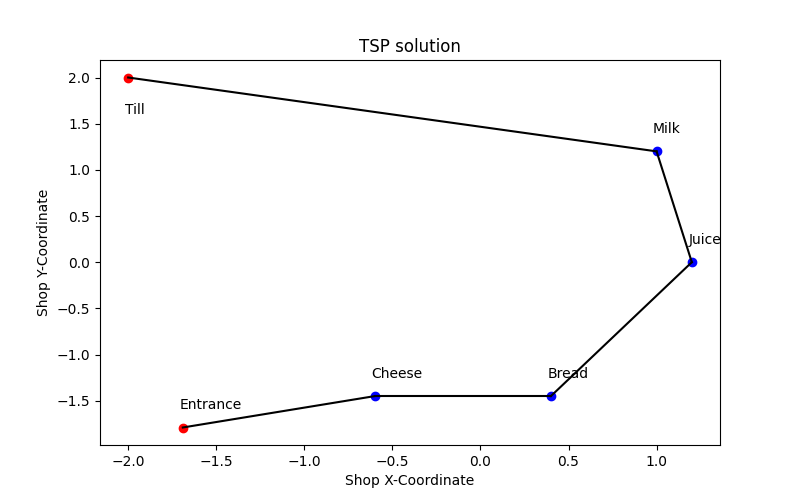

# Traveling Salesman Problem Solver

This code is a simple example of how to use the GLPK solver to solve the Traveling Salesman Problem.
This was created based on the code given from the "Planning and Decision-Making course" at TU Delft.
The code was adapted to a specific problem, where given a list of stock the code receives as input 
the items wanted from the customer and returns as output the best route to pick those items up. Starting
from the entrance of the shop and ending at the till. After solving the problem a plot is created showing 
the route that was followed.



## Installation Instructions
Following instructions are used to install the `requirements.txt` file and the `glpk` solver.

### Creating a virtual environment
Creating and sourcing the virtual environment
```bash 
virtualenv virtual_env_tsp --python="/usr/bin/python3.9"
source virtual_env_tsp/bin/activate
```

Installing the required packages
```bash
pip install -r requirements.txt
```

### Instructions to install glpk solver

Download the glpk solver from the following link
```bash
wget ftp://ftp.gnu.org/gnu/glpk/glpk-4.65.tar.gz
```

Extract the tar file
```bash
tar -xvzf glpk-4.65.tar.gz
```

Configure and install the glpk solver
```bash
cd glpk-4.65 
./configure
sudo make install
cd ..
```

## Usage
To run the solver you can use the following command
```bash
python tsp_solver.py
```
Input the items wanted by the customer by their name. 

- Press `enter` after each input.
- Press `q` to finish the input.
- to finish the input.

- A plot will be shown with the route to follow.
- The image is also saved as `TSP_solution.png`.

- To add / remove items from the stock modify the `stock.csv` file.
